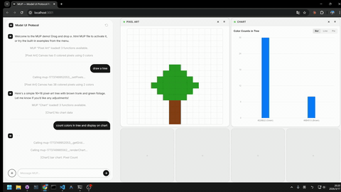
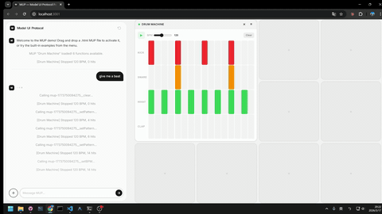
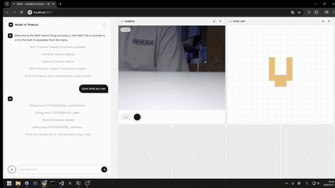
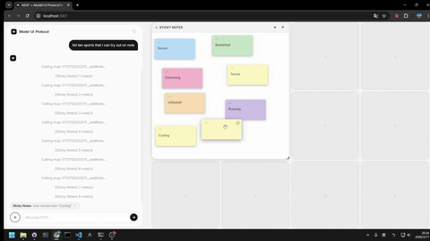
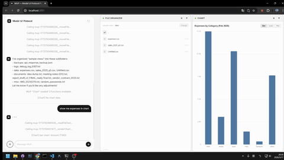

# MUP — Model UI Protocol

[](https://github.com/Ricky610329/mup/stargazers)
[](LICENSE)

[English](README.md)

> 在 LLM 聊天介面裡放進可互動的 UI — 讓每個人都能體驗 agentic AI，不只是開發者。

## 示範

<table>
<tr>
<td width="50%" align="center">



**[畫圖 & 分析](https://youtu.be/14-4sgN2hSk)** — Pixel Art + Chart

</td>
<td width="50%" align="center">



**[打節拍](https://youtu.be/vp6W5ZiFfuM)** — Drum Machine

</td>
</tr>
<tr>
<td align="center">



**[看到什麼畫什麼](https://youtu.be/jk7Hlzcy4ko)** — Camera + Pixel Art

</td>
<td align="center">



**[智慧便利貼](https://youtu.be/9EG0XhwVn1c)** — Sticky Notes

</td>
</tr>
<tr>
<td colspan="2" align="center">



**[檔案報表](https://youtu.be/wcM7zEUrIHY)** — File Organizer + Chart

</td>
</tr>
</table>

---

## MUP 是什麼？

**MUP** 是一個能嵌入 LLM 聊天介面的互動式 UI 元件。

它把畫面和功能綁在一起。使用者按按鈕操作，LLM 用 function call 操作，雙方即時看到對方做了什麼。

最簡單的 MUP 就是一個 `.html` 檔 — 不用打包、不用框架、不用裝任何東西。

## 為什麼要做這個？

Agentic AI 很強，但現在被鎖在文字指令和開發工具的高牆後面。大多數人根本碰不到。

MUP 把可以點、可以看、可以操作的 UI 直接放進聊天裡 — 不用會寫 prompt，也能使用 AI agent 的能力。

| | 傳統聊天介面 | 加上 MUP |
|---|---|---|
| **使用者怎麼操作** | 打字下指令 | 按按鈕、拉滑桿、即時看到視覺化結果 |
| **工具的回傳結果** | 使用者看不到，只有 LLM 知道 | 雙方都看得到，而且可以互動 |
| **誰能用** | 會下 prompt 的進階使用者 | 所有人 |

## 核心概念

- **一個函式，兩個入口。** 每個函式都能被 LLM 當 tool 呼叫，也能被使用者從 UI 觸發。同一份程式碼，同一個結果。
- **LLM 居中協調。** MUP 之間不直接溝通。LLM 讀取各個 MUP 的輸出，決定下一步要做什麼。
- **就是 HTML。** 寫好 manifest、註冊函式，一個檔案就能上線。

## 快速範例

```html
<script type="application/mup-manifest">
{
  "name": "Counter",
  "description": "計數器。使用者按 +/-，LLM 可以設定或讀取數值。",
  "functions": [
    {
      "name": "setCount",
      "description": "將計數器設為指定數值",
      "inputSchema": {
        "type": "object",
        "properties": { "value": { "type": "number" } },
        "required": ["value"]
      }
    }
  ]
}
</script>
```

丟進支援 MUP 的 host，直接就能用。

## 快速開始

### 1. Clone 並安裝

```bash
git clone https://github.com/Ricky610329/mup.git
cd mup/poc
npm install
```

### 2. 啟動 PoC

```bash
npm run dev
```

會在 `http://localhost:5173` 開啟 MUP host。預設為 **demo 模式**，不需要 API key，打開就能玩。

### 3. 載入 MUP

- 從內建選單選一個，或
- 直接把任何 `.html` MUP 檔拖進視窗

### 4.（選用）接上真正的 LLM

在 `poc/` 目錄建立 `.env` 檔，選擇你的 LLM 供應商：

```env
# OpenAI
VITE_LLM_PROVIDER=openai
VITE_LLM_API_KEY=sk-...
VITE_LLM_MODEL=gpt-4o

# Anthropic
VITE_LLM_PROVIDER=anthropic
VITE_LLM_API_KEY=sk-ant-...
VITE_LLM_MODEL=claude-sonnet-4-6

# Google Gemini
VITE_LLM_PROVIDER=gemini
VITE_LLM_API_KEY=AIza...
VITE_LLM_MODEL=gemini-2.5-flash

# Ollama（本地，不需要 API key）
VITE_LLM_PROVIDER=ollama
VITE_LLM_MODEL=llama3
# VITE_OLLAMA_ENDPOINT=http://localhost:11434
```

也可以不建立 `.env` — 啟動後的設定畫面可以互動選擇供應商。

建立後重啟 dev server 即可。

### 內建範例

計數器、骰子、計時器、圖表、相機、鼓機、像素畫、便利貼、檔案整理 — 9 個現成的 MUP，放在 `poc/examples/` 裡。

## 文件

- [規格書](spec/MUP-Spec.zh-TW.md)
- [範例集](spec/MUP-Examples.zh-TW.md)

## Star History

<a href="https://www.star-history.com/?repos=Ricky610329%2Fmup&type=date&legend=top-left">
  <picture>
    <source media="(prefers-color-scheme: dark)" srcset="https://api.star-history.com/image?repos=Ricky610329/mup&type=date&legend=top-left&theme=dark" />
    <source media="(prefers-color-scheme: light)" srcset="https://api.star-history.com/image?repos=Ricky610329/mup&type=date&legend=top-left" />
    
  </picture>
</a>

## 授權

[MIT](LICENSE)
